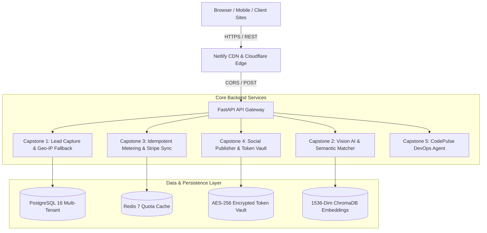

# 🏛️ FlyRank AI & Backend Systems Design Specification

**Author:** Nivedh Sunil  
**Architecture:** Multi-Tier Microservices, Event Schedulers & Agentic AI  

---

## 🗺️ 1. Global High-Level Architecture

---

## ⚡ 2. Capstone Architecture Details

### Capstone 1: Embeddable Lead-Capture Platform
* **Pattern:** Multi-tenant script injection with dynamic config caching.
* **Resilience:** Fallback chain (Provider A `ip-api.com` $\rightarrow$ Provider B `ipapi.co` $\rightarrow$ Graceful degraded persistence).
* **Security:** Nonce validation, honeypot bot trap, 100 KB payload boundary.

### Capstone 2: AI Image Understanding & Content Matching
* **Pattern:** Vision metadata extraction + Vector cosine similarity ranking.
* **Safety:** Mismatch Guard rejects low-confidence matches ($< 65\%$) to prevent false visual association.
* **Cost Accounting:** Per-call attributed token cost tracking.

### Capstone 3: LLM Usage Metering & Billing
* **Pattern:** Atomic idempotency key deduplication.
* **Pricing Engine:** Micro-cent calculation ($0.000003/input, $0.000015/output).
* **Billing Integration:** HMAC-SHA256 Stripe webhook synchronization.

### Capstone 4: Multi-Platform Social Campaign Publisher
* **Pattern:** Asynchronous durable job scheduler.
* **Image Pipeline:** Dynamic aspect ratio crops (1:1 Instagram vs 16:9 X).
* **Security:** AES-256-GCM symmetric encryption with 12-byte IVs for access tokens.
